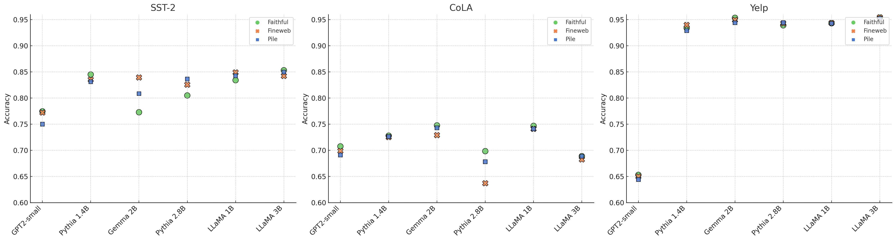
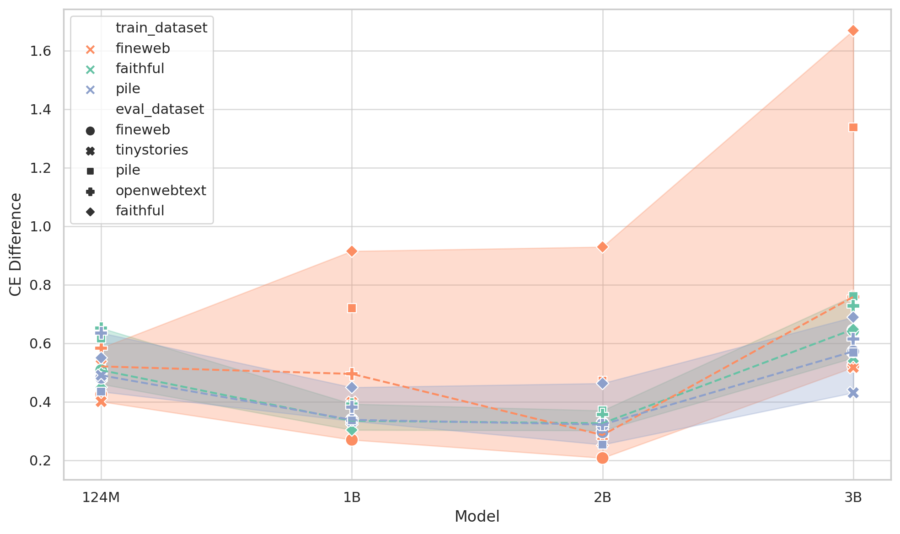
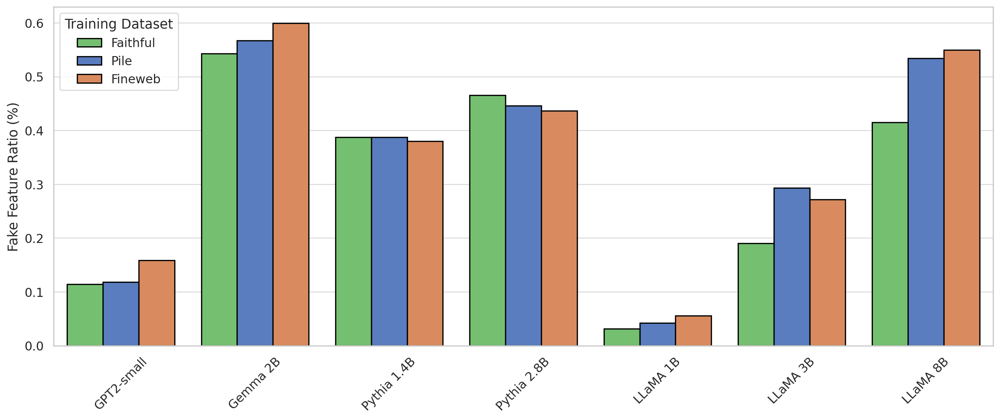

# FaithfulSAE: Training Sparse Autoencoders Without External Datasets 🎯

[](https://www.arxiv.org/abs/2506.17673)
[](https://huggingface.co/collections/seonglae/faithful-saes-67f3b25ff21a185017879b33)
[](https://huggingface.co/collections/seonglae/faithful-dataset-67f3b21ff8fca56b87e5370f)

## 🚀 Key Insight

**Sparse Autoencoders (SAEs) trained on external datasets can hallucinate features that don't exist in the model's internal representations.** We solve this by training SAEs on the model's own synthetic outputs - creating "FaithfulSAEs" that better capture genuine model-internal features.

### Why FaithfulSAE?
- 🎯 **No External Dependencies**: Train SAEs using only the model itself
- 🔬 **Better Feature Fidelity**: Lower fake feature ratio (5/7 models tested)
- 📊 **Superior Downstream Performance**: Outperforms web-trained SAEs on probing tasks
- 🔄 **More Stable**: Higher feature consistency across different seeds


*FaithfulSAEs demonstrate superior performance on downstream probing tasks.*



*FaithfulSAEs achieve better faithfulness metrics, like lower Cross-Entropy differences.*

## 🛠️ Quick Start

### Installation

```bash
# Clone the repository
git clone https://github.com/seonglae/FaithfulSAE.git
cd FaithfulSAE

# Install dependencies
pip install -r requirements.txt
```

### Generate Faithful Dataset

Generate synthetic data from any model by sampling from its own distribution:

```bash
python gen_synthetic.py vllm \
    --model_name="EleutherAI/pythia-1.4b" \
    --total_tokens=1e8 \
    --seed=42 \
    --temperature=1.0
```

### Train FaithfulSAE

We use the [BatchTopK](https://github.com/openai/sparse_autoencoder) codebase for training. Example with LLaMA configuration:

Configuration example (`config/llama_sae.py`):


## 📊 Evaluation Scripts

### 1. Feature Matching Analysis
Compare feature stability across seeds and datasets:

```bash
python scripts/feat_match.py \
    --llm_id "meta-llama/Llama-3.1-8B" \
    --layer 24 \
    --seq_len 512 \
    --lr "6e-05" \
    --topk 80 \
    --results_folder "results_llama8" \
    --steps 292967 \
    --faithful "faithful-llama3.1-8b" \
    --dict_size 16384 \
    --pile --local --fine
```

### 2. Cross-Dataset Metrics
Evaluate reconstruction quality across different datasets:

```bash
python scripts/cross_dataset_metrics.py \
    --llm_id "openai-community/gpt2" \
    --layer 8 \
    --seq_len 128 \
    --lr "0.0003" \
    --topk 16 \
    --results_folder "results_gpt2" \
    --steps 24413 \
    --faithful "faithful-gpt2-small" \
    --dict_size 12288 \
    --pile
```

### 3. Seed Sensitivity Analysis
Analyze how different initialization seeds affect learned features:

```bash
python analyse_seed_sensitivity.py \
    --model_name "pythia-1.4b" \
    --num_samples 10000
```

### 4. Measure Dataset Quality
Analyze token distribution and coverage:

```bash
python measure_dataset.py \
    --dataset_path "datasets/pythia-1.4b_42_1.0_0.9.jsonl" \
    --model_name "EleutherAI/pythia-1.4b"
```

## 📈 Key Results



*FaithfulSAEs show lower Fake Feature Ratios (lower is better).*

- **Fake Feature Ratio**: FaithfulSAEs show lower fake feature ratios in 5 out of 7 tested models
- **SAE Probing**: Superior performance on downstream tasks (SST-2, CoLA, Yelp)
- **Feature Stability**: Higher Shared Feature Ratio (SFR) compared to instruction-tuned datasets
- **Faithfulness Metrics**: Better Cross-Entropy difference and L2 reconstruction error

## 🗂️ Project Structure

```
FaithfulSAE/
├── config/               # Model configurations
├── scripts/              # Evaluation and analysis scripts
├── faithful_sae/         # Core SAE training modules
├── results_*/           # Experimental results
├── gen_synthetic.py     # Faithful dataset generation
├── train_sae.py         # SAE training script
└── measure_dataset.py   # Dataset quality metrics
```

## 📚 Citation

If you find FaithfulSAE useful in your research, please cite:

```bibtex
@inproceedings{cho2025faithfulsae,
  title={Faithful{SAE}: Towards Capturing Faithful Features with Sparse Autoencoders 
without External Datasets Dependency},
  author={Seonglae Cho and Harryn Oh and Donghyun Lee and Luis Eduardo Rodrigues Vieira 
and Andrew Bermingham and Ziad El Sayed},
  booktitle={ACL 2025 Student Research Workshop},
  year={2025},
  url={https://openreview.net/forum?id=tBn9ChHGG9}
}
```
